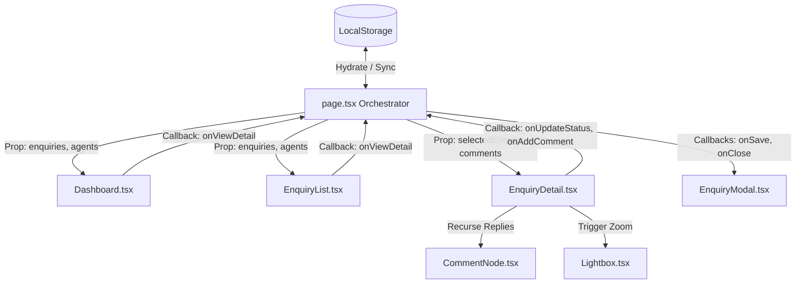

# Brindavan Udyog B2B Enquiry Tracker Monorepo

A professional, high-performance, and mobile-responsive B2B Enquiry Tracker web application built inside a **Turborepo monorepo** workspace using **Next.js 16 (App Router)**, **TypeScript**, **Tailwind CSS v4**, and `pnpm`.

Customized specifically for **Brindavan Udyog (India)**, a leading industrial grain milling accessories, conveying machinery, and sacking machinery manufacturer, this tracker enables sales agents to organize, prioritize, and log daily industrial specifications and RFQs.

---

## 🏗️ Monorepo Workspace & Architectural Overview

The project is structured as a multi-workspace Turborepo monorepo, separating design tokens/styling foundations from the application codebase to enable seamless scaling and reusability across future projects:

```
enquiry_tracker/ (Monorepo Root)
├── apps/
│   └── enquiry-tracker/             # Next.js 16 B2B Enquiry Tracker App
│       ├── src/
│       │   ├── app/
│       │   │   ├── globals.css      # App stylesheet importing shared theme tokens
│       │   │   ├── layout.tsx       # Root layout and Next.js typography loading
│       │   │   └── page.tsx         # Central State Orchestrator shell
│       │   └── components/          # Reusable, decoupled presentation sub-components
│       │       ├── Dashboard.tsx    # B2B pipeline funnel and recent activity overview
│       │       ├── EnquiryList.tsx  # Daily leads tables and date ribbon navigation
│       │       ├── EnquiryDetail.tsx # Specifications scope viewer and Twitter comments feed
│       │       └── ...
│       ├── package.json             # App package config depending on "@repo/theme"
│       └── tsconfig.json
│
├── packages/
│   └── theme/                       # Shared Theme, Tokens, and CSS style configurations
│       ├── package.json             # Package configuration exporting "@repo/theme/styles.css"
│       └── styles.css               # Discord theme variables, scrollbars, and keyframes
│
├── package.json                     # Root configuration orchestrating workspaces via turbo
├── pnpm-workspace.yaml              # pnpm monorepo workspace package mappings
└── turbo.json                       # Turborepo task pipeline execution caching
```

---

## 🔀 Data Flow & State Management

The application operates on a **Single Source of Truth** design pattern:



1. **State Orchestrator (`page.tsx`)**:
   - Manages three primary state arrays: `enquiries`, `comments`, and `agents`.
   - On mount, hydrates state asynchronously from local storage via `getStoredData()` to avoid Next.js SSR hydration mismatches.
   - Synchronizes edits down to LocalStorage using the unified `syncState(updatedEnquiries, updatedComments, updatedAgents)` callback.
2. **Decoupled Components**:
   - Sub-views (Dashboard, list, details) do not modify states directly. Instead, they trigger typed callbacks (e.g. `onUpdateStatus`, `onAddComment`, `onSave`) declared in `page.tsx`.
3. **Modal Reset Pattern**:
   - Modals and Lightboxes are loaded conditionally and mapped with dynamic key values (e.g., `key={editingEnquiry?.id || "new"}`). This forces React to unmount/mount components, re-running internal state initializers and preventing dirty stale state leaks.

---

## 💎 Core Application Views

### 1. B2B Funnel Analytics Dashboard (`Dashboard.tsx`)
- **KPI Metrics Cards (`KpiCard.tsx`)**: Highlights *Pipeline Value (INR)*, *Active Enquiries*, *Closed-Won Win Rate*, and *Total Update History Logs*.
- **Chart.js Trend Graph (`TrendChart.tsx`)**: Plots smooth growth curves over the last 7 calendar days, calculating values dynamically based on `createdAt` timestamps, and rendering a Blurple gradient overlay.
- **Pipeline Funnel (`PipelineFunnel.tsx`)**: Renders progress bars for sales stages (`New`, `Contacted`, `Qualified`, `Proposal`, `Negotiation`, `Won`, `Lost`).
- **Quick Links**: Shows the top 3 most recent enquiries with quick-jump links.

### 2. Enquiry Pipeline List (`EnquiryList.tsx`)
- **Horizontal Calendar Ribbon (`CalendarRibbon.tsx`)**: 
   - Automatically defaults the view to filter only **today's enquiries** upon loading.
   - Lists date cards for exactly the **last 5 days** (Today and 4 days prior) showing the day of the week, numeric date, and count of enquiries.
   - If a date is chosen outside this scope via the picker, a dynamic active tab is inserted temporarily for navigation.
- **Jump to Date Picker**: Incorporates a button that invokes the modern native HTML5 `showPicker()` API on a hidden input. This guarantees the browser calendar overlay displays reliably on all platforms (bypassing overlay issues on Linux/Chrome).
- **Filters Panel (`FilterControls.tsx`)**: Contains text search matching client company, contact, or title, alongside stage, priority, and agent selectors.
- **Enquiry Item Rows (`EnquiryRowItem.tsx`)**: Displays client details, assigned agent initials, estimation value, stage, and priority dot markers.
- **CSV Data Actions**: Enables bulk import and export of pipeline lists in standard CSV structure.

### 3. Enquiry Detail Split-View (`EnquiryDetail.tsx`)
- **Left Column (ClientProfile.tsx)**:
  - Displays pipeline overview, assignees, and stages.
  - **PII Masking**: Customer phone numbers and email addresses are masked by default (e.g., `sa***@rajdhaniflour.in`). Sales agents can reveal the data with a mouse-click **Reveal** button.
- **Right Column (Specifications & Requirements)**:
  - **SpecificationsSection.tsx**: Displays raw industrial specifications in bright white text (`text-zinc-900 dark:text-white font-medium`) for maximum readability, alongside an Instagram-style photo gallery thumbnail grid.
  - **Threaded Twitter Comments**: Post-comment inputs are positioned at the **top** of the timeline. Thread parent logs are sorted **reverse chronologically** (newest first), while replies stack chronologically.
  - **ActivityTimeline.tsx**: Displays chronological update logs (assignment changes, stage transitions, received date updates) listed newest first.

### 4. Image Lightbox Viewer (`Lightbox.tsx`)
- Opens full-screen zoom overlays on a transparent, blurred background.
- Enables sliding prev/next controls with navigation arrows and index indicator badges.
- **Keyboard Navigation**: Registers global event listeners enabling **Right Arrow (`→`)** for next photo, **Left Arrow (`←`)** for previous photo, and **Escape (`Esc`)** to close the preview window.

---

## 🛠️ Monorepo Setup & Development Guide

### Prerequisites
Ensure you have Node.js (v18+) and `pnpm` installed.

### 1. Install Dependencies (from Monorepo Root)
```bash
pnpm install
```
This resolves workspace mappings and links `@repo/theme` directly into the app workspace.

### 2. Spin Up Development Servers
```bash
pnpm run dev
```
Starts Next.js for `@repo/enquiry-tracker` with Turborepo task piping. Open [http://localhost:3000](http://localhost:3000) to view the application.

### 3. Compile and Build
Build all workspaces concurrently using Turborepo pipeline caching:
```bash
pnpm run build
```

### 4. Lint and Formatting Compliance
Run linting checks across all workspace modules:
```bash
pnpm run lint
```
