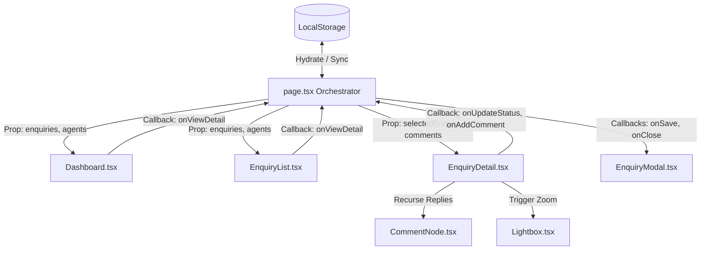

# Brindavan Udyog B2B Enquiry Tracker

A professional, high-performance, and mobile-responsive B2B Enquiry Tracker web application built using **Next.js 16 (App Router)**, **TypeScript**, **Tailwind CSS v4**, and `pnpm`. 

Customized specifically for **Brindavan Udyog (India)**, a leading industrial grain milling accessories, conveying machinery, and sacking machinery manufacturer, this tracker enables sales agents to organize, prioritize, and log daily industrial specifications and RFQs.

---

## 🏗️ Architectural Overview & File Structure

The application is built on a highly modular component architecture, transitioning from a single monolithic shell to decoupled, reusable, strongly-typed components.

```
enquiry_tracker/
├── src/
│   ├── app/
│   │   ├── globals.css         # Styling system, theme tokens, and transition animations
│   │   ├── layout.tsx          # HTML shell, metadata, and typography bindings
│   │   └── page.tsx            # Central State Orchestrator & Layout shell
│   │
│   ├── components/             # Reusable, decoupled presentation components
│   │   ├── Dashboard.tsx       # KPI metrics, SVG growth trend charts, and pipeline funnels
│   │   ├── EnquiryList.tsx     # Calendar ribbon navigation, search, and tabular list filters
│   │   ├── EnquiryDetail.tsx   # Specifications panel, masking toggles, and Twitter-like threads
│   │   ├── CommentNode.tsx     # Recursive component for threaded comments
│   │   ├── EnquiryModal.tsx    # Unified Create/Edit form withReceived Date picker and multi-photo uploads
│   │   ├── Lightbox.tsx        # Zoom overlays with Left/Right arrow & Escape key navigation
│   │   └── ToastContainer.tsx  # Floating status notifications Alert stack
│   │
│   └── mockData.ts             # Mock database, data types, LocalStorage sync helpers
├── package.json
└── tsconfig.json
```

---

## 🔀 Data Flow & State Management

The application operates on a **Single Source of Truth** design pattern:



1. **State Orchestrator (`page.tsx`)**:
   - Manages three primary state arrays: `enquiries`, `comments`, and `agents`.
   - On mount, hydrates state asynchronously from local storage via `getStoredData()` to avoid Next.js SSR hydration mismatches.
   - Synchronizes edits down to LocalStorage using the unified `syncState(updatedEnquiries, updatedComments, updatedAgents)` callback.
2. **Decoupled Components**:
   - Sub-views (Dashboard, list, details) do not modify states directly. Instead, they trigger typed callbacks (e.g. `onUpdateStatus`, `onAddComment`, `onSave`) declared in `page.tsx`.
3. **Modal Reset Pattern**:
   - Modals and Lightboxes are loaded conditionally and mapped with dynamic key values (e.g., `key={editingEnquiry?.id || "new"}`). This forces React to unmount/mount components, re-running internal state initializers and preventing dirty stale state leaks.

---

## 💎 Core Application Views

### 1. B2B Funnel Analytics Dashboard (`Dashboard.tsx`)
- **KPI Metrics Cards**: Highlights *Pipeline Value (INR)*, *Active Enquiries*, *Closed-Won Win Rate*, and *Total Update History Logs*.
- **SVG Line Chart**: Plots custom growth trends over the last 7 calendar days, calculating values dynamically based on `createdAt` timestamps.
- **Pipeline Funnel**: Renders progress bars for sales stages (`New`, `Contacted`, `Qualified`, `Proposal`, `Negotiation`, `Won`, `Lost`).
- **Quick Links**: Shows the top 3 most recent enquiries with quick-jump links.

### 2. Enquiry Pipeline List (`EnquiryList.tsx`)
- **Horizontal Calendar Ribbon**: 
  - Automatically defaults the view to filter only **today's enquiries** upon loading.
  - Lists date cards for exactly the **last 5 days** (Today and 4 days prior) showing the day of the week, numeric date, and count of enquiries.
  - If a date is chosen outside this scope via the picker, a dynamic active tab is inserted temporarily for navigation.
- **Jump to Date Picker**: Incorporates a button that invokes the modern native HTML5 `showPicker()` API on a hidden input. This guarantees the browser calendar overlay displays reliably on all platforms (bypassing overlay issues on Linux/Chrome).
- **Search & Filters**: Contains text search matching client company, contact, or title, alongside stage, priority, and agent selectors.
- **CSV Data Actions**: Enables bulk import and export of pipeline lists in standard CSV structure.

### 3. Enquiry Detail Split-View (`EnquiryDetail.tsx`)
- **Left Column (B2B Profile)**:
  - Displays pipeline overview, assignees, and stages.
  - **PII Masking**: Customer phone numbers and email addresses are masked by default (e.g., `sa***@rajdhaniflour.in`). Sales agents can reveal the data with a mouse-click **Reveal** button.
- **Right Column (Specifications & Requirements)**:
  - **High Contrast Details**: Displays raw industrial specifications in bright white text (`text-zinc-900 dark:text-white font-medium`) for maximum readability.
  - **3-Photo Gallery Grid**: Aligns up to 3 technical drawings side-by-side. If there are 4 or more photos, an Instagram-style overlay (`+X drawings`) is rendered on the 3rd thumbnail.
  - **Threaded Twitter Comments**: Post-comment inputs are positioned at the **top** of the timeline. Thread parent logs are sorted **reverse chronologically** (newest first), while replies stack chronologically.
  - **Audit Logs Timeline**: Tracks updates (stage changes, assignments, received date revisions) listed newest first.

### 4. Image Lightbox Viewer (`Lightbox.tsx`)
- Opens full-screen zoom overlays on a transparent, blurred background.
- Enables sliding prev/next controls with navigation arrows and index indicator badges.
- **Keyboard Navigation**: Registers global event listeners enabling **Right Arrow (`→`)** for next photo, **Left Arrow (`←`)** for previous photo, and **Escape (`Esc`)** to close the preview window.

---

## 🛠️ Setup & Development Guide

### Prerequisites
Ensure you have Node.js (v18+) and `pnpm` installed.

### 1. Install Dependencies
```bash
pnpm install
```

### 2. Spin Up Development Server
```bash
pnpm run dev
```
Open [http://localhost:3000](http://localhost:3000) to view the application in your browser.

### 3. Compile and Build
Confirm TypeScript compiling and build production assets:
```bash
pnpm run build
```

### 4. Lint and Formatting Code Quality
Ensure typescript format compliance:
```bash
pnpm run lint
```
